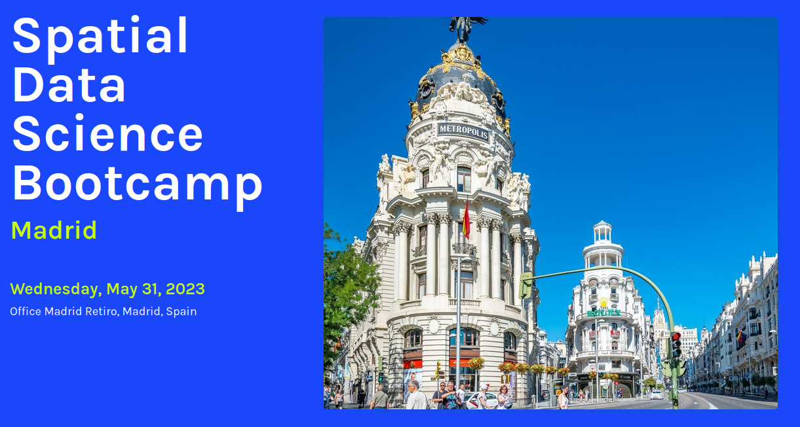

### Spatial Data Science Conference Bootcamp - 2023 - Madrid

# Foundations of Geospatial 

https://spatial-data-science-conference.com/bootcamps/2023/Madrid/



### Additional Resources

* Original version of this workshop by Danny Sheehan - https://github.com/nygeog/sdsc
* Class for Pratt SAVI 810 2020-03: Intro to Python Scripting for Geospatial - https://github.com/pratt-savi-810/pratt-savi-810-2020-03
* Geographic Data Science Lab is a research centre at the University of Liverpool -  https://www.liverpool.ac.uk/geographic-data-science/
* CSC Finland – IT Center for Science - Welcome to Introduction to Python GIS -course 2018 - https://automating-gis-processes.github.io/CSC/index.html
* https://modern-gis-curriculum-new-learngis.hub.arcgis.com/
* https://introduction-to-remote-sensing-learngis.hub.arcgis.com/
* https://learn.arcgis.com/en/gallery/
* https://geobgu.xyz/py/index.html
* https://pygis.io/docs/a_intro.html
* https://spatialthoughts.com/courses/
* Geographic Data Science, a course designed by Dr. Dani Arribas-Bel - https://darribas.org/gds_course/content/home.html


## Setup

### Get the materials

Either:
* Download the repo from <https://github.com/jsanz/sdsc/archive/refs/heads/madrid.zip>
* Clone this repo and switch to the `madrid` branch. In one step: 

```
git clone --branch madrid --single-branch --depth 1 https://github.com/jsanz/sdsc.git
```


### Run the notebook with `docker`

* Build the image: `docker build -t sdsc .`
* Run the image `docker run --rm -p 8888:8888 sdsc:latest` (remember to mount the repo if you want to keep changes with `-v ${PWD}:/sdsc`)
* Open your browser at `http://localhost:8888?token=sdsc`

### Run with `pip` and a virtual environment

Ensure you have at least python 3.8 with `python --version` and `pip` installed.

* Ensure you have `python-venv` installed on your system: https://docs.python.org/3/library/venv.html
* Create a new virtual environment in the `env` folder: `python3 -m venv env`
* Activate the environment: `source env/bin/activate`
* Install the requirements: `pip install -r requirements.txt`
* Start the Jupyter notebook system: `jupyter notebook`

> :warning: if `pip` can't get binaries for your operating system you may need to install other libraries (gdal, gcc, etc.) to build the python packages.

### Run with `miniconda` 

> These are the original setup instructions from Danny Sheehan

I generally recommend using Miniconda - https://docs.conda.io/en/latest/miniconda.html - for managing geospatial python environments. 

> Miniconda is a free minimal installer for conda. It is a small, bootstrap version of Anaconda that includes only conda, Python, the packages they depend on, and a small number of other useful packages, including pip, zlib and a few others. Use the conda install command to install 720+ additional conda packages from the Anaconda repository. - https://docs.conda.io/en/latest/miniconda.html

Latest Miniconda installers - https://docs.conda.io/en/latest/miniconda.html#latest-miniconda-installer-links

Once Miniconda is set up, create an env: 

`conda create -n sdsc python=3.8`

Activate your Conda environment. 

`conda activate sdsc`

Conda install from requirements.txt

`conda install --yes --file requirements.txt`


#### List of Installations

Install Jupyter Lab

`pip install jupyterlab` 

Install GeoPandas

`conda install geopandas` 

Install Rasterio 

`pip install rasterio`

Install Folium

`conda install folium -c conda-forge --yes`

IPyLealeft

`conda install -c conda-forge ipyleaflet`

Enable extension

`jupyter nbextension enable --py --sys-prefix ipyleaflet`

Raster Stats

`pip install rasterstats` 

Rise

`pip install RISE`

OSMnx (Optional)

`!conda install osmnx -y`


#### Create Conda Requirements file

`conda list -e > requirements.txt`